# Simple Villagers - Fabric

依赖 Fabric Loader 0.19.3+、Fabric API、Java 21+

支持 Minecraft 1.21.11、26.1 与 26.2 版本

## 功能模块

### 交易所

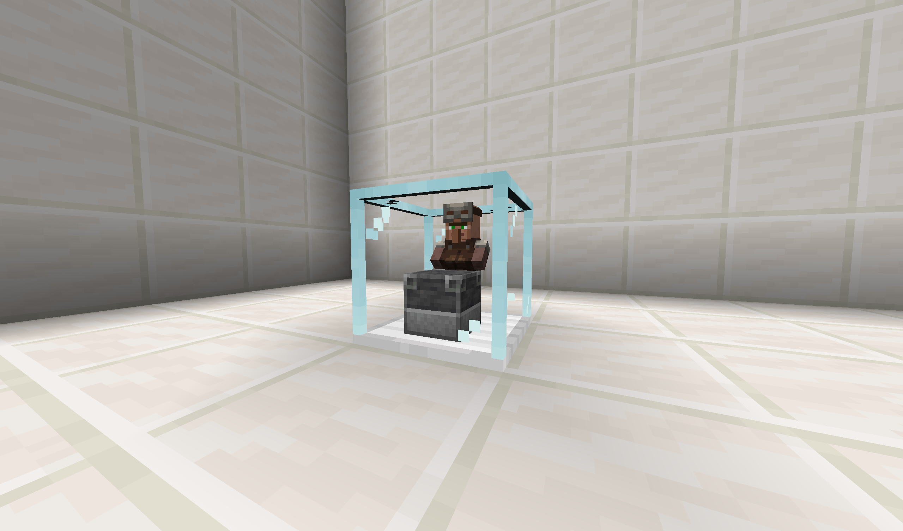

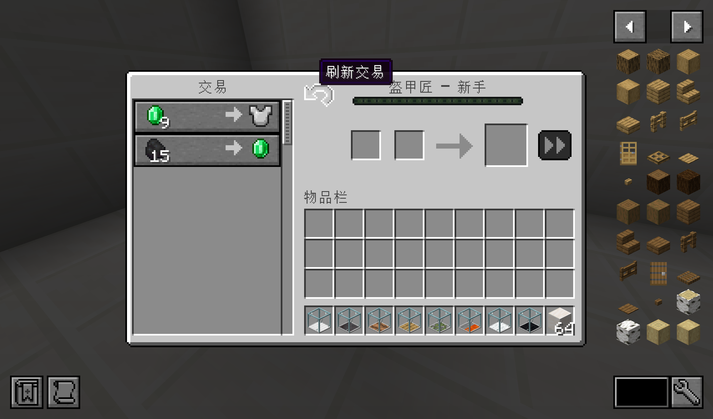

> 放入村民和对应职业的工作方块即可打开交易界面。支持交易刷新按钮（仅限未交易过的条目），
> 配合 C 键快捷键可快速刷新。

### 自动交易所

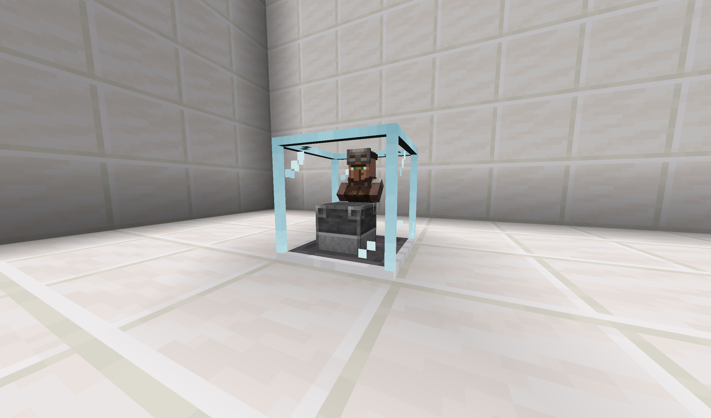

> 自动执行交易的设备。通过漏斗从上方输入要交易的物品和村民，下方用漏斗接出交易产物。支持配置交易速度和补货间隔。

### 农场

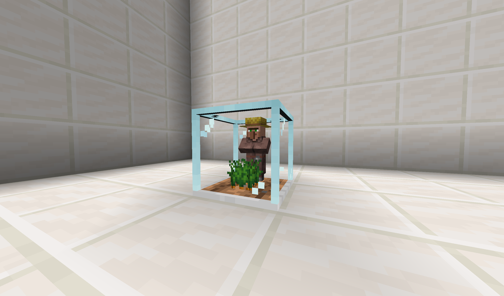

> 村民会自动种植、照料和收获范围内的作物。可通过配置文件设置禁用特定种类的作物（黑名单），控制农场的工作速度。

### 村民繁殖器

> 放入两个村民和食物，会自动繁殖产生小村民。

### 培育所

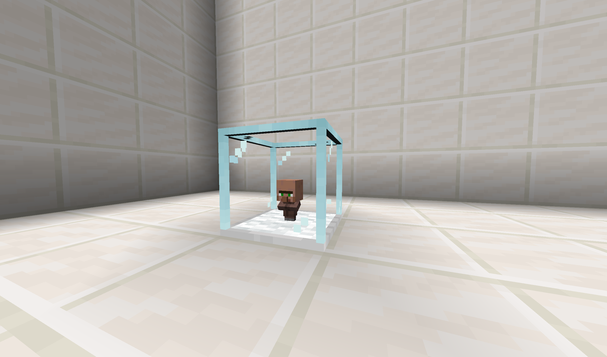

> 加速小村民成长。放入小村民后随时间增长年龄，直至成长为成年村民。
>
> 成长速度可在配置文件中调整。

### 村民转化器

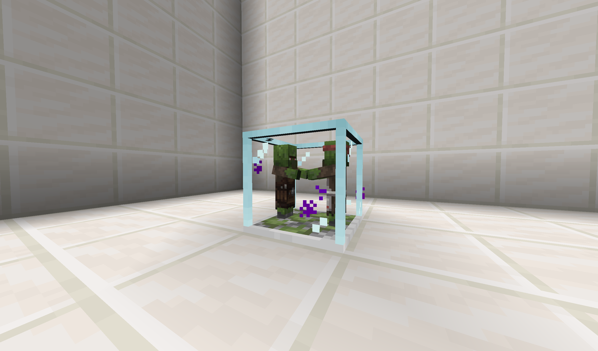

> 治愈僵尸村民。放入虚弱药水（或虚弱箭）和金苹果后，僵尸村民会开始转化，
> 一段时间后变为普通村民。支持配置转化时间和是否启用通用声望。
>
> 转化期间会有粒子产生

### 铁傀儡农场

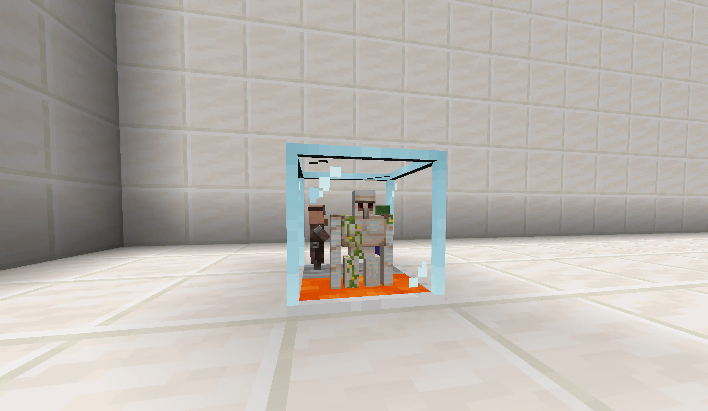

> 村民会自动生成铁傀儡，生成的铁傀儡会被击杀并掉落铁锭。
> 生成间隔可在配置文件中调整。

### 背包查看器

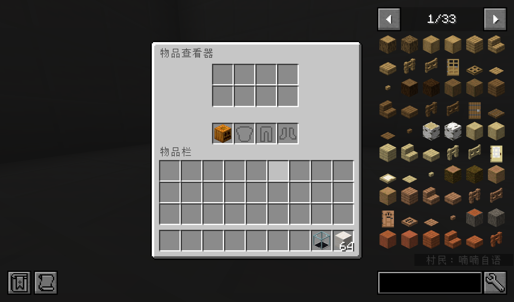

> 查看和操作村民的物品栏、装备和盔甲。方便管理村民身上的物品。

## 配置文件

配置文件位于 `.minecraft/config/simplevillager/` 目录下。

版本隔离配置文件位于 `.minecraft\versions\<version>\config\simplevillager`

### client.toml

| 选项 | 默认值 | 说明 |
|---|---|---|
| `sneak_pickup` | `true` | 是否可以通过潜行+右键拾取村民 |
| `volume` | `0.5` | 村民互动音效音量（`0.0` - `1.0`） |
| `cycle_trades_button_location` | `"TOP_RIGHT"` | 交易刷新按钮位置。可选值：`"TOP_LEFT"`、`"TOP_RIGHT"`、`"NONE"` |
| `render_block_contents` | `true` | 是否在方块上方渲染内部物品/村民 |
| `block_render_distance` | `48` | 渲染方块内容的最大距离（方块数） |

### server.toml

| 选项 | 默认值 | 说明 |
|---|---|---|
| `breeding_time` | `1200` | 村民繁殖所需时间（刻，20刻=1秒） |
| `converting_time` | `1900` | 僵尸村民转化所需时间（刻） |
| `farmer_speed` | `10` | 农民收割多少次作物后暂停 |
| `crop_blacklist` | `[]` | 农民不会收割的作物 ID 列表，例：`["minecraft:nether_wart"]` |
| `golem_spawn_time` | `1100` | 铁傀儡生成间隔（刻） |
| `trader_restock_time` | `100` | 交易站补货间隔（刻） |
| `trader_restock_uses` | `100` | 交易多少次后触发补货 |
| `trader_max_uses` | `20` | 每个交易选项的最大可交易次数 |
| `auto_trader_speed` | `100` | 自动交易站交易间隔（刻） |
| `incubator_speed` | `1` | 培育所速度倍数（越大成长越快） |
| `villager_sounds` | `true` | 与村民互动时是否播放音效 |
| `trade_cycling` | `true` | 是否启用交易刷新按钮 |
| `universal_reputation` | `false` | 是否启用全局声望（折扣全局生效） |
| `auto_trader_infinite` | `false` | 自动交易站无限模式，交易不会耗尽，无需补货 |

## 配方

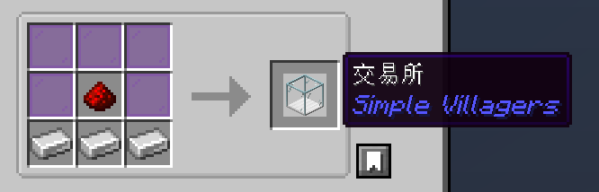

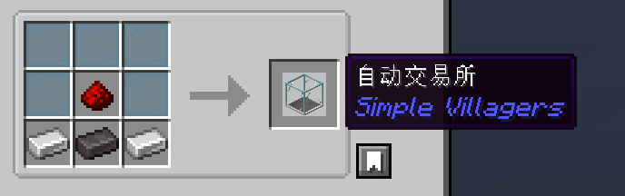

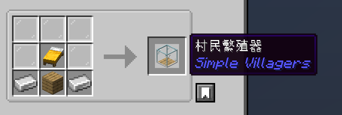

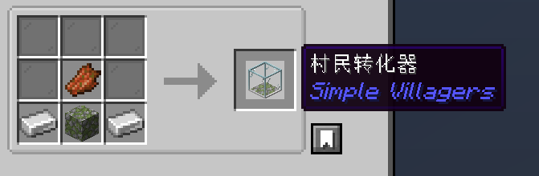

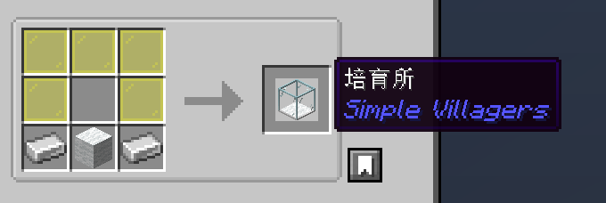

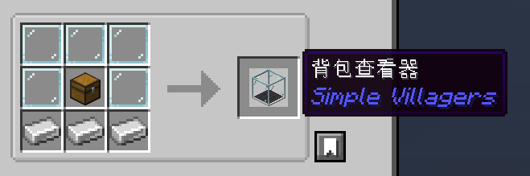

## 命令

| 命令 | 权限 | 说明 |
|---|---|---|
| `/sv reload` | 0（所有人） | 热重载配置文件，无需重启世界 |

